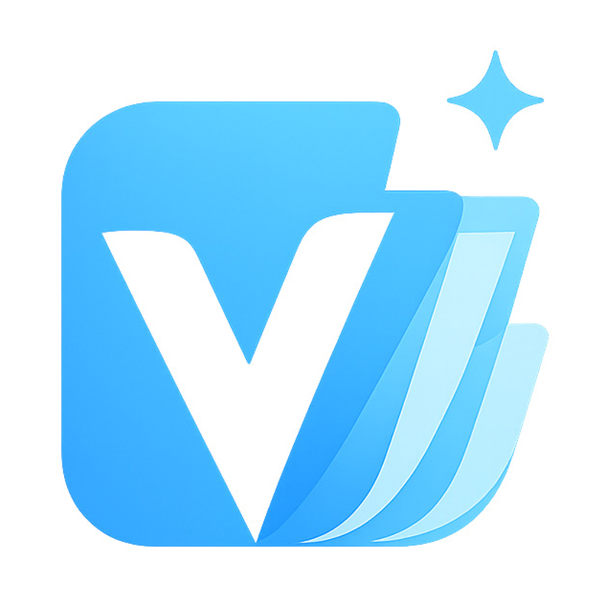

<p align="center">
  
</p>

<h1 align="center">Verko</h1>

<p align="center">
  <strong>Agent-first paper management.</strong><br>
  Your papers are plain Markdown files. Your AI assistant can read them, write them, and answer questions about them.
</p>

<p align="center">
  <a href="https://github.com/CatVinci-Studio/Verko/releases/latest"><strong>Download</strong></a> ·
  <a href="https://catvinci-studio.github.io/Verko/"><strong>Try in browser</strong></a> ·
  <a href="./README.zh.md">中文</a>
</p>

<p align="center">
  <a href="https://github.com/CatVinci-Studio/Verko/releases/latest"></a>
  
  <a href="./LICENSE"></a>
</p>

---

## What it is

A desktop app (and a read-only web app) for organizing academic papers. Your library is a plain folder of Markdown files — no proprietary database, no lock-in. An AI agent of your choice reads and writes that library through the same files you see.

## Why

- **Your data stays yours.** A CSV plus a folder of Markdown files. Open in Excel, VS Code, anywhere. Version-control with Git.
- **AI does the busywork.** Ask in natural language: *"summarize my unread NLP papers"*, *"tag the diffusion ones"*, *"import this arXiv paper"*. The agent reads and writes the same files you see.
- **Bring your own model.** OpenAI, Claude, or Gemini — paste your API key, switch any time.
- **Works online too.** The web build connects directly to your S3 / R2 / B2 bucket — same UI, same agent.

## Install

### Desktop

| Platform | Download |
|---|---|
| macOS (Apple Silicon) | `Verko-X.Y.Z-arm64.dmg` |
| macOS (Intel) | `Verko-X.Y.Z.dmg` |
| Windows | `Verko-Setup-X.Y.Z.exe` |
| Linux | `Verko-X.Y.Z.AppImage` / `verko_X.Y.Z_amd64.deb` |

→ Get the latest at [Releases](https://github.com/CatVinci-Studio/Verko/releases/latest).

### Web

[catvinci-studio.github.io/Verko](https://catvinci-studio.github.io/Verko/) — connect any S3-compatible bucket (AWS S3, Cloudflare R2, Backblaze B2, MinIO). Your bucket needs CORS allowed for the page origin.

## Quick start

1. Launch Verko → pick **Open existing folder** or **Create new local library** (web build: **Connect S3** instead).
2. Open **Settings → Agent**, paste an API key for OpenAI / Claude / Gemini.
3. Press **⌘K** or click the Agent in the sidebar — ask anything about your library.

## Your library, on disk

```
my-library/
  papers.csv                       ← canonical field data: title, authors, status, …
  papers/
    2017-vaswani-attention.md      ← your free-form notes (markdown only)
  attachments/
    2017-vaswani-attention.pdf
  schema.md                        ← column definitions (yours to extend)
  collections.json                 ← collection membership
  skills/                          ← optional: your agent workflow templates
```

`papers.csv` is the source of truth for every field — open it in Excel, edit a column, the app picks up the change. Each paper's `.md` file holds only the notes body:

```markdown
## Key insight

Replace recurrence with self-attention...

## My takeaway

Read the section on positional encoding twice.
```

## What the agent can do

Out of the box:

- **Search and summarize** across the whole library
- **Add / update** papers — direct CSV edits, or import from arXiv
- **Look at PDF pages** (with vision-capable models — figures, equations, tables)
- **Manage collections and tags**
- **Take notes** as you read; `@`-mention papers in chat to pin them to the current question

You can extend the agent with your own **skills** — drop a markdown file in `skills/` with `name` + `description` frontmatter. The agent sees the description in its prompt and loads the body on demand.

When a conversation gets long, type `/compact` to compress it; the full transcript is archived. Earlier turns get summarized so the next ones stay coherent without burning context.

All file access is scoped to registered library directories — the agent literally cannot reach files outside.

## Build from source

```bash
git clone https://github.com/CatVinci-Studio/Verko.git
cd Verko
npm install
npm run dev          # Electron dev mode
npm run build:web    # Static web build → dist-web/
npm run dist:mac     # or :win / :linux
```

Requires Node 20+. Codebase layout: [CLAUDE.md](./CLAUDE.md).

## License

[MIT](./LICENSE) © CatVinci Studio
